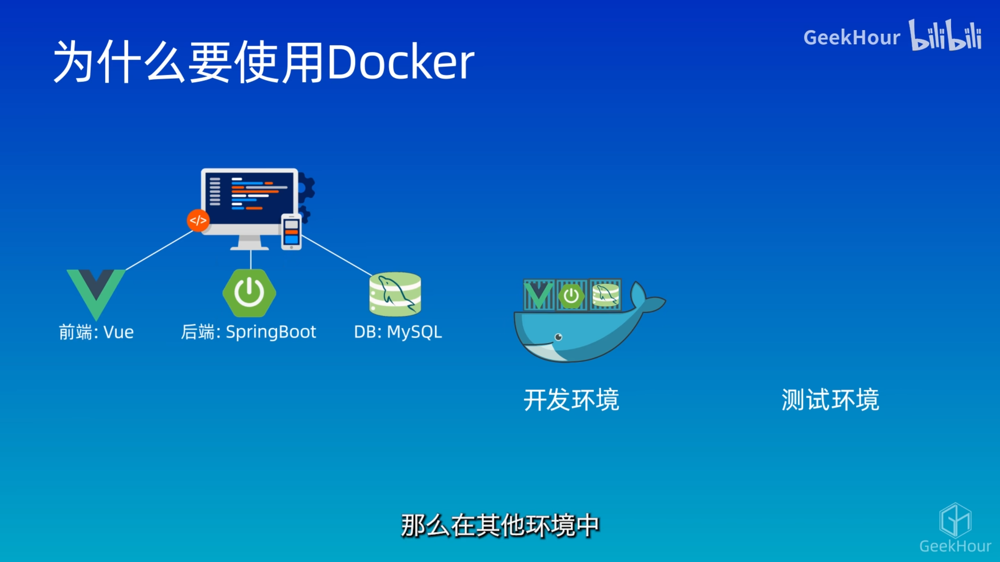
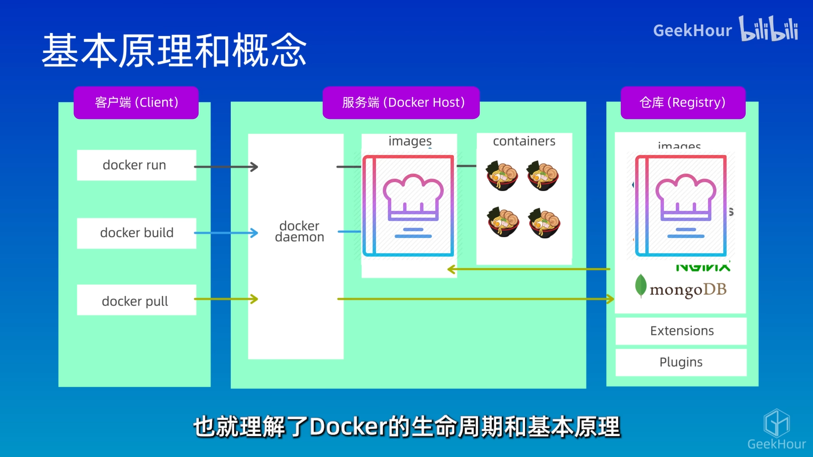
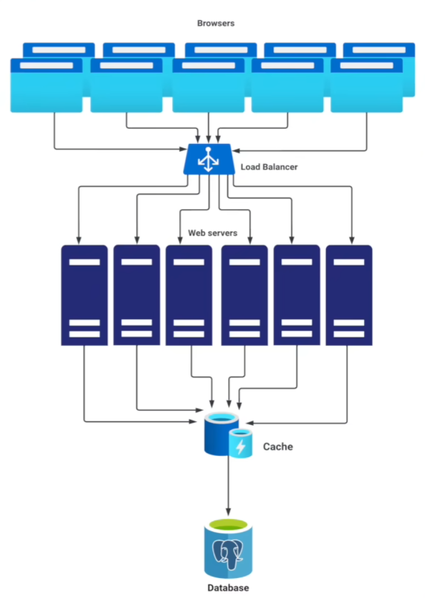

# 前言


# linux


## 服务器运维实操

- 查看服务器配置

  ```bash
  free -h  # 查看内存使用情况
  df -h  # 查看磁盘空间使用情况
  uname -a  # 查看操作系统信息
  
  
  ```

- 查看是否安装

  ```bash
  docker --version
  docker info
  ps aux | grep docker
  whereis docker
  
  
  ```

  


- 格式化实体服务器 重装系统

  引导服务器从U盘启动：Del、F2、F10 

  使用 [rufus](https://rufus.ie/zh/#google_vignette) 制作 CentOS U盘启动盘


# docker (轻量虚拟机)

## 概念

- 定位：轻量级虚拟机、部署环境

  理念：将应用程序的代码、工具库和运行环境都封装到了一个容器 (降低测试和部署的难度)

  操作：docker命令

- BigPicture

  基本概念、安装配置、常用命令

  构建镜像、运行容器、DockerCompose & Kubernetes

  应用隔离、环境配置、安装部署

  持续集成、持续发布、DevOps


- 概念

  docker：是一个用于构建`build`、运行`run`、传送`share`应用程序的平台

  

  

- 虚拟机与docker：虚拟化、资源整合

  虚拟化技术：将物理资源虚拟为多个逻辑资源 (环境隔离 独立运行)

  - **虚拟机**占用了大量资源：需要的是一个web服务、但虚拟机启动完整OS (资源浪费 启动慢)

  - **容器**：使用宿主机的操作系统 (资源占用少 启动快 上百容器)

    (docker是容器化解决方案之一)

  

- 基本原理

  `images`：只读模板，用来创建容器 (类 食谱)

  `containers`：docker的运行实例，提供了独立的可移植环境 (实例对象 菜肴)

  `registry`：存储docker镜像，最流行的仓库是dockerhub

  

  


## 实操

### 安装docker

- 官网

  https://www.docker.com/


- win

  开启hyper-v

  下载
  
  ```
  docker version  # 客户端 服务端
  docker info
  ```
  
  

- 国内镜像配置

  ```json
  {
    "builder": {
      "gc": {
        "defaultKeepStorage": "20GB",
        "enabled": true
      }
    },
    "experimental": false,
    "registry-mirrors": [
      "https://registry.docker-cn.com",
      "https://docker.mirrors.ustc.edu.cn",
      "https://hub-mirror.c.163.com",
      "https://mirror.ccs.tencentyun.com",
      "https://ud6340vz.mirror.aliyuncs.com"
    ]
  }
  ```

  


### 容器化和Dockerfile

- 容器化：将应用程序打包成容器，然后在容器中运行应用程序的过程

  实现：

  1. 创建一个`Dockerfile` (告诉docker构建应用程序镜像所需的步骤和配置)

  2. 使用dockerfile构建镜像
  3. 使用该镜像创建和运行容器

  

- 【案例】

  C:\Users\16654\Desktop\HelloDocker\index.js

  ```javascript
  console.log("hello docker")
  ```

  ```
  node .\index.js  # node 运行时环境 在浏览器以外的地方运行js
  ```

  OS、nodejs；应用程序复制；运行

  C:\Users\16654\Desktop\HelloDocker\Dockerfile

  ```
  FROM 基础镜像  # 环境
  COPY 源路径即相对于dockerfile 目标路径即相对于镜像的路径  # 项目
  
  # CMD [ "可执行程序的名字","传入参数",... ]
  CMD 可执行程序的名字 传入参数...
  ```
  
  ```dockerfile
  FROM node:14-alpine
  COPY index.js /index.js
  
  # CMD [ "node","/index.js" ]
  CMD node /index.js
  ```
  
  ```
  # 构建镜像
  docker bulid -t hello-docker:0.0.1 .  # hello-docker是镜像的名字 版本号  .表示当前目录
  docker images  # docker iamge ls  查看所有镜像

  # 运行
  docker run hello-docker:0.0.1
  ```
  
  

- 把镜像上传至[dockerhub](https://hub.docker.com/)

  [在线docker环境](https://labs.play-with-docker.com/)

  ```
  # 上传镜像
  docker tag hello-docker:0.0.1 plktime1043/hello-docker:0.0.1  # 指定用户 快捷方式
  docker push plktime1043/hello-docker:0.0.1

  # 需要登录
  docker login

  # 拉取镜像
  docker pull plktime1043/hello-docker:0.0.1
  ```
  
  

- volumes

  docker容器中的数据是不会持久化的

  volumes：docker中用于存储数据的，即把容器中的指定路径映射到宿主机上 (数据在宿主机的磁盘上持久化)


- DevEnv Beta

  每个人都在一个相同的环境下开发


- DockerCompose

  用来定义和运行多个docker容器应用程序的工具 (vue、springboot、mysql、redis、nginx 既独立又关联)

  使用`docker-compose.yaml`文件来配置应用程序的服务 (将互相关联的容器组合 形成项目)

  一条命令即可创建并启动所有服务

  ```
  docker compose up
  ```

  

### 数据卷挂载


## 【案例】编程语言环境

### python

- python

  ```
  docker search python  # 检索
  docker pull python:3.8-alpine3.18  # 拉取镜像
  ```

  


### java


## 【案例】数据库安装

### postgreSQL

- 参考

  [dockerHub:postgreSQL](https://hub.docker.com/_/postgres)、[windocker安装postgres教程](https://www.cnblogs.com/an-shiguang/p/17840671.html)

- 命令

  ```bash
  docker search postgres  # 检索
  docker pull postgres:16-alpine3.19  # 拉取镜像
  docker images  # 查看本地镜像
  
  # run 创建并运行一个容器
  docker run --name mypostgres \
  			-e POSTGRES_DB=database \
  			-e TZ=PRC \
  			-e POSTGRES_USER=root \
  			-e POSTGRES_PASSWORD=123456 \
  			-p 5432:5432 \
  			-v D:\\systemEnvironment\\pastgresData:/var/lib/postgresql/data \
  			-d postgres:16-alpine3.19
  # -name 容器名称mypostgres
  # -e TZ=PRC 中国时区
  # -e POSTGRES_USER=root 用户名是root（不设置默认用户名postgres）
  # -e POSTGRES_DB=database DB模式数据库模式
  # -e POSTGRES_PASSWORD 密码
  # -p 5432:5432端口映射，把容器的5432端口映射到服务器的5432端口
  # -v 将数据存到宿主服务器
  # -d 后台运行
  
  # 进入容器
  docker exec -it mypostgres bash
  psql -U root -d database
  
  create database hyzdb;  # 创建数据库
  \c hyzdb;  # 切换数据库
  
  docker volume create mydata  # 创建数据卷
  docker volume ls  # 查看所有数据卷
  docker volume inspect mydata  # 查看数据卷信息
  
  ```
  
  
  
  ```
  # 一个坑：win明明端口没被占用却显示占用  ps管理员权限
  net stop winnat
  net start winnat
  ```
  


### Redis

- win docker安装redis

  ```bash
  docker run --restart=always -p 6379:6379 \
  			--name myredis -d redis:7.0.12 \
  			--requirepass 123456
  
  cd /d/systemEnvironment/docker-containers/redis/
  
  docker run -d --privileged=true /
  			--restart=always -p 6379:6379 \
  			-v D:\\systemEnvironment\\docker-containers\\redis\\redis.conf:/etc/redis/redis.conf \
  			-v D:\\systemEnvironment\\docker-containers\\redis\\data:/data \
  			--name myredis redis:4.0 redis-server /etc/redis/redis.conf --appendonly yes
  # –privileged=true：容器内的root拥有真正root权限，否则容器内root只是外部普通用户权限
  # -v /docker/redis/conf/redis.conf:/etc/redis/redis.conf：映射配置文件
  # -v /docker/redis/data:/data：映射数据目录
  # redis-server /etc/redis/redis.conf：指定配置文件启动redis-server进程
  # –appendonly yes：开启数据持久化
  
  ```

  


### mongoDB

- 命令

  ```
  docker run --name mymongo \
  			-p 27017:27017 \
  			-v D:\\systemEnvironment\\mongo\\configdb:/data/configdb \
  			-v D:\\systemEnvironment\\mongo\\db:/data/db \
  			-d \
  			--auth
  ```

  


## 【案例】大数据组件

### hadoop

- hadoop

  


### spark


### flink


# 数据库盘点

- 关系型数据库

  定义：就是按关系存储数据的，可以建立一对一，一对多，多对多的关系。再通俗一点就是由行和列组成的表。

  产品：mysql

  场景：

  观看视频、发布视频的都是这个视频网站的用户

  关于用户的信息可能存在一张用户表中，用户id，用户昵称，个人信息介绍等

  视频可能被存储在视频表中，这个表中有视频id，视频标题，简介，以及视频ur等信息

  用户和视频应该是一对多的关系，怎么建立这种关系呢，可能是视频表中有一个用户id，来将视频和用户连接起来


- 非关系型数据库

  数据是以非表格的方式被组织起来。也可以说数据是半结构或非结构的。比如刚刚提到的redis，他就是以键值对形式存储的。另外还有列式、文档型和图存储。

- 键值对

  定义：存储格式就是字典，根据key来读取value

  产品：redis、rocksDB、Abase。

  场景：这种比较适合不涉及复杂数据业务关系的，大量读写场景。(像我现在就有大量用到kv存储数据库，不过根据业务，支持的数据量、qPS，延迟等要求，我们选择了abase，这是字节开源的数据库)

- 列式存储

  定义：数据是按列存储

  产品：hbase、clickhouse、doris

  场景：大数据量，适合批量对某些列进行聚合计算；列压缩效率高;使用xx社交平台的几亿用户，有用户的个人信息(年龄，性别，地域等)，以及平台上的信息(粉丝量，最近一次登陆时间，最近一周活跃时长)等。然后要对用户进行一次营销活动，比如圈出平台最近10天，在上海地区的年轻人，并且喜欢看二次元的，然后在首页推出一个漫展的广告。

- 图数据库

  定义：存储实体及其关系，实体指的节点，关系就通过实体的边来描述；这样构成一张图，另外顶点和边还用属性来描述其详细信息。

  产品：Neo4i、ByteGraph

  场景：支持数据量大，比如用于目前的社交网络、知识图谱，数据量能达上亿级别；另外处理很复杂的关系，也不用设计关系表，不用考虑复杂的连表操作;而且数据量大的时候，做多层关系，查询效率也高。比如现在现在要建立视频和用户的关系，可以设计两种类型顶点，分别表示视频和用户;边可以定义用户、视频之间的关系

- 文档型

  定义：以ISON/XML格式进行存储

  产品：mongoDB，Elasticsearch


# PostgreSQL

- 参考

  python for everyone、django for everyone、web applications for everyone

  postgres for everyone


## 概念

- 数据库：储存数据、操作修改数据、检索查找数据

- 两类数据库

  *Relational Database*：采用了 关系模型(sql) 来组织数据的数据库、行列表

  - 常见有：PostgreSQL、MySQL、MariahDB(副本)、Oracle(付费)、SQLite(轻量 嵌入式)、SQL Server

  *non Relational Database*：

  - 常见有：redis、mongoDB、Cassandra、HBase

- PostgreSQL和MySQL的对比

  MySQL：国内使用最多；只支持部分sql标准、不那么严谨、老油条风格

  PostgreSQL：欧美使用多、社区活跃；支持所有sql标准、学院派的严谨、完全开源BSD/MIT、源码很清晰


- web业务 CRUD

  create、read、update、delete

  index、join、foreign key


- 安装 win  [PostgreSQL官网](https://www.postgresql.org/) 

- docker

  ```bash
  docker exec -it mypostgres bash
  createdb yzzy
  psql yzzy
  
  ```

  


## 通用sql

- 基础命令

  ```bash
  \h  # 显示sql命令说明
  \?  # 显示pgsql命令说明
  \l  # 数据库列表
  \q  # 退出
  
  \c hyzdb  # 切换数据库
  create database hyzdb;  # 创建数据库
  drop database yzzy;  # 删除数据库
  
  \d  # 查看该数据库下的表情况
  \d user_tb  # 查看该表的情况
  
  ```

  表的创建删除 [PostgreSQLdata type](https://www.postgresql.org/docs/current/datatype.html)、[PostgreSQL 数据类型](http://www.postgres.cn/docs/9.3/datatype.html)

  ```sql
  # 创建表
  create table user_tb2 (
      id bigserial not null primary key,
      name varchar(200) not null,
      gender varchar(7) not null,
      birthday date not null,
      email varchar(250)
  );
  
  # 删除表
  drop table user_tb2;
  
  ```

  表数据

  ```sql
  # 查询数据
  select * from user_tb2;
  
  # 插入数据
  insert into user_tb2 (name, gender, birthday, email) 
  values 
  ('alice', 'female', '1990-05-15', 'alice@example.com'),
  ('bob', 'male', '1985-10-20', 'bob@example.com');
  insert into user_tb2 (name, gender, birthday) values ('charlie', 'male', '1995-03-25');
  
  # 更新数据
  update user_tb2 set id = 10 where id = 1;
  
  # 删除数据 (不推荐硬删除 推荐逻辑删除)
  delete from user_tb2 where id = 2;
  # 逻辑删除 (添加表字段)
  alter table user_tb2 add column removed boolean not null default(false); 
  # 添加主键
  alter table user_tb2 add primary key(id);
  
  ```
  
  mock数据 [mockaroo](https://mockaroo.com/)
  
  ```bash
  docker cp user_tb.sql mypostgres:/hyzdata/user_tb.sql
  docker exec -it mypostgres bash
  psql -U root -d yzzy -f /hyzdata/user_tb.sql
  
  ```
  
  查询语句
  
  ```sql
  # 排序 (order by  asc desc)
  select * from user_tb order by first_name desc;
  # 去重 (distinct)
  select distinct country_of_birth from user_tb 
  order by country_of_birth;
  
  # 条件 (where  and or) 
  select * from user_tb where country_of_birth = 'China' and gender = 'Male';
  
  # 比较 comparison
  select 1 > 2;
  select 4 >= 1;
  select 2 <> 2;  # 不等于
  
  # 翻页 (limit offset)
  from user_tb limit 5 offset 10;
  
  # in between like ilike(大小写不敏感)
  select * from user_tb where country_of_birth in ('China','Sweden');
  select * from user_tb where date_of_birth between '2000-11-11' and '2003-09-09';
  select * from user_tb where first_name like '%ll';
  select * from user_tb where first_name like '__ll';
  
  # 分组 (group by  having)
  select country_of_birth, count(*) from user_tb group by country_of_birth;
  select country_of_birth, count(*) from user_tb group by country_of_birth having count(*) > 10;
  
  # 聚合函数 (min max avg round sum)
  
  ```
  
  join
  
  ```sql
  # 交叉连接 (cross join)
  
  # 内连接 (inner join)
  
  # 外连接 (left outer join  right outer join  full outer join)
  
  ```
  
  


## 特性


# dameng (国产)


# Redis (性能极高)

- 概念

  Remote dictionary server：开源的、基于**内存**的 数据存储系统

  应用：DB Cache、MQ (DB **IO**开销大)

- 优势

  性能记高

  数据类型丰富，单键值对最大支持512M大小的数据

  简单易用，支持所有主流编程语言

  支持数据持久化、主从复制、哨兵模式等高可用特性


- 安装

  docker

  ```bash
  docker search redis
  docker pull redis
  docker run --restart=always -p 6379:6379 \
  			--name myredis -d redis:7.0.12 \
  			--requirepass 123456
  
  docker exec -it myredis bash
  redis-server  # 服务端 开机自启
  redis-cli -a 123456  # 客户端
  
  ```

- 使用方式

  CLI：Command Line Interface ([Redis-CLI](https://redis.io/docs/manual/cli))

  API：Application Programming Interface (programming language)

  GUI：Graphical User Interface ([Redis Insight](https://redis.io/docs/connect/insight/))


- 常用命令

  


- 数据类型

  五种基本数据类型：`String`、`List`、`Set`、`SortedSet`、`Hash`

  五种高级数据类型：`Stream`、`Geospatial HyperLogLog`、`Bitmap`、`Bitfield`

- 键值对数据

  键是大小写敏感的、默认使用字符串来存储数据(二进制安全)、默认不支持中文(二进制形式)

- String

  ```bash
  # 设置 读取 删除 判断
  set name zhou
  get name  # "zhou"
  set Name Zhou
  get Name  # "Zhou"
  
  del name  # 删除
  exists name  # 判断一个键是否存在
  
  keys *me  # 查看数据库有哪些键 
  flushall  # 删除所有的键 (慎用)
  
  # 中文显示问题
  quit
  redis-cli --raw
  
  
  # 查看键的过期时间
  ttl name  # time to live
  # 设置一个带有过期时间的键值对
  expire name 10
  setex name 10 zhou
  # 只有当键不存在才创建
  setnx name zhou
  
  ```

- List (有序列表)

  ```bash
  # 添加
  lpush letter a
  lpush letter b c  # 最后添加在最前
  rpush letter z  # 尾部添加
  # 获取
  lrange letter 0 -1
  # 删除
  lpop letter  # 头部弹出
  rpop letter 2  # 尾部弹出
  ltrim letter 0 3  # 保留 不在范围的都删掉
  # 查看列表长度
  llen letter
  
  
  # 实现简单的消息队列 (其他实现 stream)
  lpush  # 头添加
  rpop  # 尾弹出
  
  ```

- Set (无序集合 元素不能重复)

  ```bash
  # 添加
  sadd course Redis  # 不能添加重复的元素
  # 获取
  smembers course
  # 判断
  sismember course Redis
  # 删除
  srem course Redis
  
  # 集合的交集并集运算
  sinter
  sunion
  sdiff
  
  ```

- SortedSet ZSet (有序集合)

  每个元素都会关联一个浮点类型的分数 按照此分数从小到大排序 

  分数可以重复

  ```bash
  # 添加
  zadd result 680 tsinghua 679 peking 650 zhu
  # 获取
  zrange result 0 -1  # 仅元素 (全部)
  zrange result 0 -1 withscores  # 加分数 (全部)
  zscore result tsinghua  # 知元素查分数 (单个)
  zrank result tsinghua  # 知元素查index (单个)
  zrevrank result tsinghua  # 反转 reverse
  # 删除某个元素
  # 对某个元素的分数增加
  
  ```

- Hash (字符类型的字段和值的映射表 键值对的集合 适合存储对象)

  ```bash
  # 添加
  hset person name zhou 
  hset person age 22
  # 获取
  hget person name 
  hgetall person
  hkeys person  # 获取所有键
  hlen person  # 获取所有键值对数量
  # 删除
  hdel person age 
  # 判断
  hexists person name 
  
  ```

  


- 发布订阅模式

  弊端：消息无法持久化、无法记录历史消息

  ```bash
  # 将消息发送到指定频道
  publish time1043 flink
  # 订阅这个频道
  subscribe time1043  # 可以多个订阅
  
  ```

- Stream (轻量级的消息队列 解决消息持久化)

  ```bash
  # 添加
  xadd time1043 1-0 course github  # 手动设置id
  xadd time1043 * course spark  # *表示自动生成消息id kv
  xadd time1043 * course docker  # "1712571786871-0"
  # 查看
  xlen time1043  # 个数
  xrange time1043 - +  # 详细内容 -+ 开始结束
  # 删除
  xdel time1043 1712571786871-0
  xtrim time1043 maxlen 0  # 删除所有
  # 消费
  xread count 2 block 1000 streams time1043  # 没有消息的就阻塞1000s 0即从头开始读取
  ```

  


- 事务

  


- 数据持久化

  


- 主从复制

  


- 哨兵模式

  


- 集群部署

  


# System Design

- 参考课程：

  [Alex Xu的系统设计面试课程](https://schelley.co/alex)、[SystemExpert](https://algoexpert.io/schelley) 、[System Design Interview模拟面试](https://schelley.co/coach) 

  Java: 带你实现一个多线程网络爬虫, 教你用Maven做大型项目

  Python (后端方向): 带你用Python Flask框架做项目, 开发网站后端

  Python (数据科学方向): 带你用Python分析数据, 助你成为data scientist

  Python (AI方向): 由前Google工程师和3Blue1Brown作者授课, 带你用Python搭建AI应用

  编程入门: 由前Google资深工程师带你做项目, 学编程

  JavaScript (全栈方向): 带你用JavaScript做full stack开发

  JavaScript (纯前端方向): 带你用JavaScript开发网站前端

  C++: 带你用C++做5个硬核项目

  Algorithms: 带你实现Google Map导航算法，深入理解算法原理和应用

  Android: 由Google Android团队工程师授课, 教你零基础开发Android应用

  Machine Learning入门: 带你用PyTorch入门机器学习

  自动量化交易: 带你用深度学习实现AI trading

- 参考文档：

  [Facebook和YouTube的分布式关系性数据库](https://schelleyyuki.com/distributed-sql-database)


- Q：Google、Facebook 是如何支撑全球几十亿用户？

- 系统设计

  **Load Balancing**：访问不是直接拿给某个 `web server` 处理、而是先经过 `load balancer` 均匀分发流量 (保护web server)

  - 优点：均匀分发、轻松扩容(high scalability、high availability)
  - 实现：route robin、least connection、hashing

  **Database Design**：设计数据库模型 data model -> 数据库的选型

  - 数据模型高度结构化 (youtube metadata) -> 关系型数据库 集群 (Vitess)
  - 数据模型凌乱结构不统一(电商网站的产品目录) -> NOSQL (cassandra HBase MongoDB) 
  - 设计 data partitioning 方案

  **Caching**：database是网站最慢的部分，若web server直接给db发请求，访问量一大则 db IO过载 (保护database 减少db查询)

  - 常见：Mencache、redis
  - 应用：1963 cache 引入 cpu 设计

  **Content Delivery Network**：把网站的静态内容分发到全球，用户浏览器从最近的CDN节点拿东西

  **Asynchronous Processing**：不用等待任务完成就可以开启新的任务 (耗时的任务 ytb上传视频)

  - 实现：message queue (RabbitMQ、kafka)
  - 应用：分布式系统、后端开发、前端开发

  


# clash


# v2rayN


