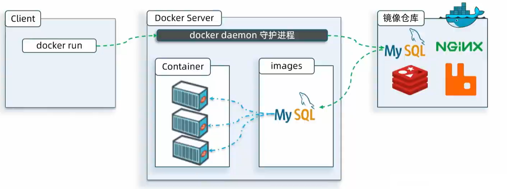
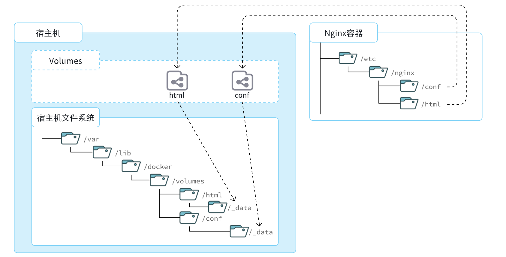
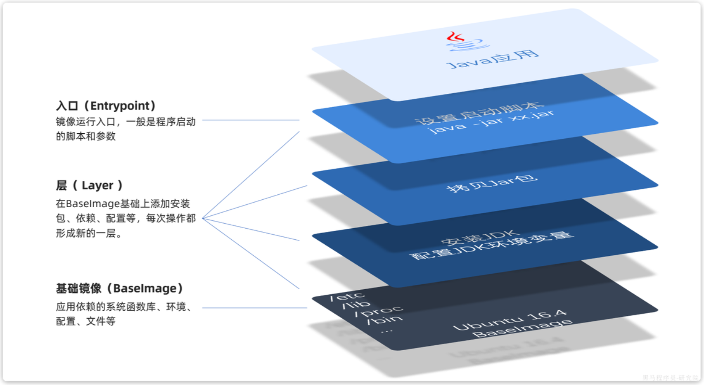
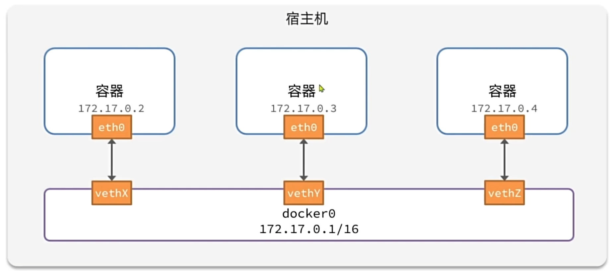
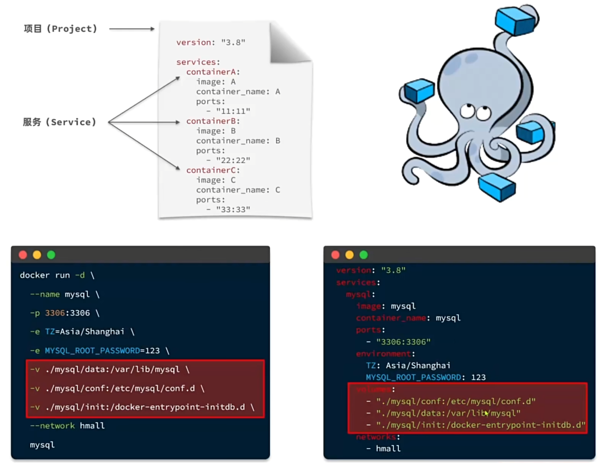
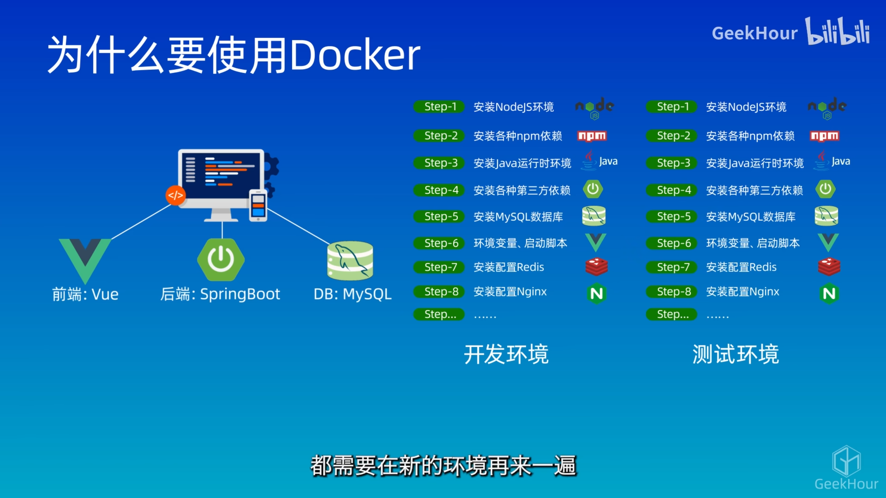
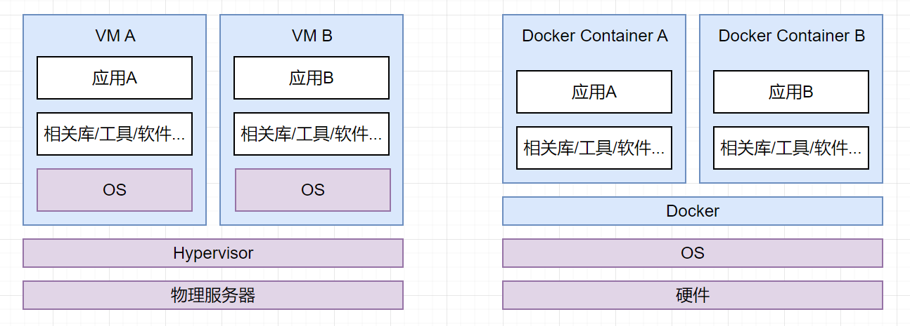
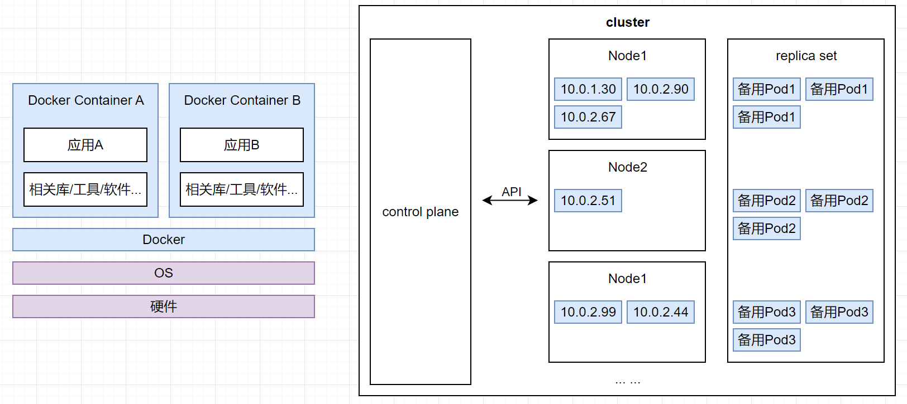
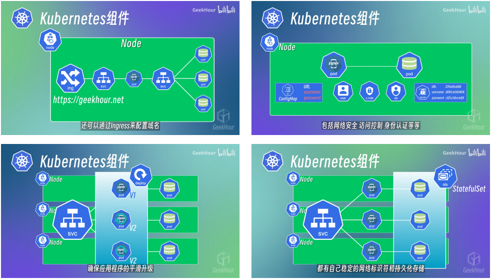

# docker

- 定位

  轻量级的虚拟机

  快速构建build、运行run、传送share应用的工具

  


- 参考

  [黑马博客文章](https://b11et3un53m.feishu.cn/wiki/MWQIw4Zvhil0I5ktPHwcoqZdnec)

- 官网

  [docker 官网](https://www.docker.com/)、[docker hub 镜像仓库](https://hub.docker.com/)、

  [docker docs](https://docs.docker.com/engine/install/centos/)、[docker命令文档查询](https://docs.docker.com/engine/reference/commandline/run/)、[docker 中文文档](http://www.dockerinfo.net/docker%E5%AE%89%E8%A3%85-windows)、

  [kubernetes 官网](https://kubernetes.io/)、[kubernetes docs](https://kubernetes.io/docs/home/)、[minikube docs](https://minikube.sigs.k8s.io/docs/start/)、[k3s](https://k3s.io/)
  
  [在线环境 docker](https://labs.play-with-docker.com/)、在线环境 Killercoda、在线环境 Play-With-K8s、
  
  [geekhour note](https://geekhour.net/)、[同学笔记](https://www.yuque.com/xiaoguai-pbjfj/cxxcrs/ocefqltbmbgl5eqg?singleDoc#)
  
  


# heima23

## 快速入门

- 有无docker

  无docker的部署：手动的linux命令、shell脚本 (项目架构逐渐复杂)

  - 命令太多记不住、步骤太多容易出错、安装包太多不知哪里下

  用docker去部署：简单！！！

  - 一键部署 (k8s 容器编排技术)

  


### 无docker部署

- 部署MySQL centos ([post](https://juejin.cn/post/7110209311824936991) 没用过)

  准备环境：查看系统环境、[下载安装包](https://dev.mysql.com/downloads/mysql/ )

  开始安装：卸载自带的、安装、初始化服务、启动服务、验证

  ```bash
  # 准备环境 卸载
  lsb_release -a  
  yum list installed | grep mariadb && yum list installed | grep mysql
  yum -y remove mariadb-libs.x86_64
  
  # 开始安装
  rpm -ivh mysql-community-common-8.0.29-1.el7.x86_64.rpm
  rpm -ivh mysql-community-client-plugins-8.0.29-1.el7.x86_64.rpm
  rpm -ivh mysql-community-libs-8.0.29-1.el7.x86_64.rpm
  rpm -ivh mysql-community-libs-compat-8.0.29-1.el7.x86_64.rpm
  rpm -ivh mysql-community-devel-8.0.29-1.el7.x86_64.rpm
  rpm -ivh mysql-community-client-8.0.29-1.el7.x86_64.rpm
  rpm -ivh mysql-community-icu-data-files-8.0.29-1.el7.x86_64.rpm
  rpm -ivh mysql-community-server-8.0.29-1.el7.x86_64.rpm
  # mysql-community-devel 安装失败
  yum install openssl-devel -y
  
  # 查看安装完成后的安装包
  rpm -qa | grep mysql
  rpm -qa | grep mariadb
  
  # 初始化MySQL服务
  mysqld --initialize --user=mysql
  grep "password" /var/log/mysqld.log
  # 启动MySQL服务
  service mysqld start
  
  ```

- 部署MySQL ubuntu18 (没用过)

  ```bash
  # 查看mysql的依赖项
  dpkg --list|grep mysql
  # 卸载
  sudo apt-get remove mysql-common
  sudo apt-get autoremove --purge mysql-server-5.7
  dpkg -l|grep ^rc|awk '{print$2}'|sudo xargs dpkg -P
  
  # 下载安装
  wget -c https://dev.mysql.com/get/mysql-apt-config_0.8.10-1_all.deb
  sudo dpkg -i mysql-apt-config_0.8.10-1_all.deb
  
  ```

  


### 安装docker

- [centos7 docker安装](https://docs.docker.com/engine/install/centos/) (成功)

  ```bash
  su root
  
  # 卸载旧版
  yum remove docker \
      docker-client \
      docker-client-latest \
      docker-common \
      docker-latest \
      docker-latest-logrotate \
      docker-logrotate \
      docker-engine
      
  # 配置Docker的yum库
  yum install -y yum-utils
  yum-config-manager --add-repo https://download.docker.com/linux/centos/docker-ce.repo
  # 安装Docker
  yum install -y docker-ce docker-ce-cli containerd.io docker-buildx-plugin docker-compose-plugin
  
  # 启动
  systemctl start docker
  systemctl stop docker
  systemctl restart docker
  systemctl enable docker
  # 校验
  docker run hello-world
  docker ps
  
  ```

- 配置国内镜像：[aliyun docker 镜像加速](https://cr.console.aliyun.com/cn-heyuan/instances/mirrors)

  ```bash
  sudo mkdir -p /etc/docker
  sudo tee /etc/docker/daemon.json <<-'EOF'
  {
    "registry-mirrors": ["https://xxxxxxxx.mirror.aliyuncs.com"]
  }
  EOF
  sudo systemctl daemon-reload
  sudo systemctl restart docker
  ```
  
- [ubuntu18 docker 安装](https://docs.docker.com/engine/install/ubuntu/)

  ```bash
  
  
  ```
  
  


### 用docker部署

- [部署MySQL docker](https://hub.docker.com/_/mysql) 

  ```bash
  docker run -d \
    --name mysql \
    -p 3306:3306 \
    -e TZ=Asia/Shanghai \
    -e MYSQL_ROOT_PASSWORD=123456 \
    mysql
    
  docker exec -it 231f0da2d3ac bash
  mysql -uroot -p123456
  
  ```

- 命令解读

  `docker run -d` ：**创建**并**运行**一个容器，`-d`则是让容器以**后台进程**运行
  
  `--name mysql ` : 给容器起名字mysql (容器名字唯一)
  
  `-p 宿主机端口:容器内端口`: 设置端口映射 (宿主机端口可任意指定 尽量与容器内一致)
  
  `-e KEY=VALUE` : 配置容器内进程运行时参数 (设置时区 设置MySQL默认密码)
  
  `REPOSITORY:TAG` : Docker会根据这个名字搜索并下载镜像 (不指定版本号默认latest)
  
  


## docker基础

### 基本概念

- [基本概念](https://docs.docker.com/guides/docker-concepts/the-basics/what-is-a-container/)

  images：安装包(包含依赖环境 隔离的)

  containers：镜像的实例

  repository：存放很多镜像

  

- 延展概念

  volumes：数据挂载

  Dockerfile：镜像的清单

  DockerCompose：容器编排
  
  


### 常见命令

- 常用命令

  

- 镜像操作：

  `docker pull` (从仓库拉取镜像)、`docker images` (查看本地所有镜像)、`docker rmi` (删除本地指定镜像)、

  `docker build` (从dockerfile构建镜像)、`docker save` (镜像文件本地保存)、`docker load` (镜像文件本地加载)、`docker push` (上传镜像到仓库中)、

- 容器操作：

  `docker run` (由镜像创建并运行容器)、`docker stop` (停止容器的运行)、`docker start` (恢复容器的运行)、`docker restart` (重启容器)

  `docker ps` (查看容器列表)、`docker rm` (删除指定的容器)、

  `docker exec` (进入到容器内部)、`docker logs` (查看容器运行日志进行排错)、`docker inspect` (查看容器详细信息)

- 数据卷命令：

  `docker volume create` (创建数据卷 不用操作)、`docker volume ls` (查看所有数据卷)、`docker volume rm` (删除指定数据卷)、

  `docker volume prune` (清除未被引用的数据卷)、`docker volume inspect` (查看某个数据卷的详情)、

  (容器与数据卷的挂载要在创建容器时配置，对于已创建容器，不能设置数据卷。而且创建容器的过程中，数据卷会自动创建)

- 网络命令：

  `docker network create` (创建一个网络)、`docker network ls` (查看所有网络)、`docker network rm ` (删除指定网络)、
  
  `docker network prune` (清除未使用的网络)、`docker network inspect` (查看网络详细信息)、
  
  `docker network connect` (使指定容器连接加入某网络)、`docker network disconnect` (使指定容器连接离开某网络)
  
- dockerCompose命令：

  `docker compose [OPTIONS] [COMMAND]`
  
  `-f` (指定compose文件的路径和名称 当前目录下省略)、`-p` (指定project名称。project就是当前compose文件中设置的多个service的集合，是逻辑概念)
  
  `up` (创建并启动所有service容器)、`down` (停止并移除所有容器、网络)、`ps` (列出所有启动的容器)、`log` (查看指定容器的日志)、
  
  `stop` (停止容器)、`start` (启动容器)、`restart` (重启容器)、`top` (查看运行进程)、`exec` (在指定的运行中容器中执行命令)
  
  


- 部署mysql (重做)

  ```bash
  docker pull mysql:8
  docker images
  
  docker run -d \
    --name mysql \
    -p 3306:3306 \
    -e TZ=Asia/Shanghai \
    -e MYSQL_ROOT_PASSWORD=123456 \
    mysql:8
    
  docker ps
  docker logs mysql
  
  docker exec -it mysql bash
  mysql -uroot -p123456  # it is inside the container
  mysql -h 192.168.64.138 -u root -p123456  # remote connection for win
  
  docker stop mysql
  
  ```

- [部署nginx](https://hub.docker.com/_/nginx)

  镜像操作

  ```bash
  docker pull nginx
  docker images 
  
  
  # save the image as a compressed file
  docker save --help  # docker save [OPTIONS -o] IMAGE [IMAGE...]
  docker save -o mynginx.tar nginx:latest
  
  # delete the image
  docker rmi nginx
  
  # load the image as a compressed file
  docker load --help  # docker load [OPTIONS -i -q]
  docker load -i mynginx.tar 
  
  ```

  容器操作

  ```bash
  docker run -d --name nginx -p 80:80 nginx
  docker ps
  docker ps --format "table {{.ID}}\t{{.Image}}\t{{.Ports}}\t{{.Status}}\t{{.Names}}"
  # http://192.168.64.138/
  
  docker stop nginx
  docker start nginx
  docker ps 
  
  docker logs -f nginx  # -f 持续输出
  docker inspect nginx
  docker exec -it nginx bash 
  
  docker rm nginx
  docker rm -f nginx  # 发现无法删除，因为容器运行中，强制删除容器
  
  ```

  


- 自定义命令 (命令的别名)

  ```bash
  vim /root/.bashrc 
  
  # append
  alias dps='docker ps --format "table {{.ID}}\t{{.Image}}\t{{.Ports}}\t{{.Status}}\t{{.Names}}"'
  alias dis='docker images
  
  source /root/.bashrc
  
  ```

  


### 数据卷挂载 volumes

- 问题

  容器内修改文件困难、容器内的数据持久化

- 解决方案

  数据卷挂载：只写名称

  本地目录挂载：带斜杆(相对路径 绝对路径)

  

  


- 安装nginx (数据卷挂载)

  ```bash
  docker run -d \
    --name nginx \
    -p 80:80 \
    -v html:/usr/share/nginx/html \
    nginx
  			
  docker volume ls
  docker volume inspect html 
  
  # verify
  ll /var/lib/docker/volumes/html/_data
  cd /var/lib/docker/volumes/html/_data
  vi index.html
  
  # verify
  docker exec -it nginx bash
  cd /usr/share/nginx/html/ 
  
  ```

  


- [安装mysql (数据卷挂载 不匿名)](https://hub.docker.com/_/mysql)

  数据目录(Where to Store Data)：`-v /my/own/datadir:/var/lib/mysql`

  配置文件(Using a custom MySQL configuration file)：`-v /my/custom:/etc/mysql/conf.d`

  初始化脚本(Initializing a fresh instance)：`/docker-entrypoint-initdb.d`

  ```bash
  mkdir -p /opt/data/mysql/data /opt/data/mysql/conf /opt/data/mysql/init  # rz -E
  
  docker run -d \
    --name mysql \
    -p 3306:3306 \
    -e TZ=Asia/Shanghai \
    -e MYSQL_ROOT_PASSWORD=123456 \
    -v /opt/data/mysql/data:/var/lib/mysql \
    -v /opt/data/mysql/conf:/etc/mysql/conf.d \
    -v /opt/data/mysql/init:/docker-entrypoint-initdb.d \
    mysql:8
    
  ```

  


### 自定义镜像 Dockerfile

- 对比

  原生配置：linux环境、安装配置JDK、上传Jar包、运行jar包

  打包镜像：Linux基础环境、安装配置JDK、拷贝jar包、配置启动脚本

- 镜像的结构

  `BaseImage`：Linux基础环境

  `Layer`：JDK、Jar

  `Entrypoint`：启动脚本

  

- [DockerFile语法](https://docs.docker.com/reference/dockerfile/) (描述镜像的结构)

  主要
  
  `fromcentos:6`  指定基础镜像
  
  `env key value`  设置环境变量
  
  `copy ./xx.jar /tmp/app.jar`  拷贝本地文件到镜像指定目录
  
  `run yum install gcc`  在镜像内部执行shell命令
  
  `expose 8080`  声明容器运行时的监听端口 (只是描述给镜像使用者看的)
  
  `entrypoint java -jar xx.jar`  配置容器启动时执行的命令，不可被 docker run 覆盖
  
  其他
  
  `maintainer your name <youremail@example.com>`  指定镜像的作者信息
  
  `cmd ["nginx", "-g", "daemon off;"]`  指定容器启动时执行的命令
  
  `workdir /app`  设置工作目录
  
  `volume /data`  创建挂载点，用于持久化数据
  
  `user nobody`  设置执行 run、cmd 和 entrypoint 指令时的用户名或 UID
  
  


- 基于Ubuntu镜像来构建一个Java应用

  ```dockerfile
  # 指定基础镜像
  FROM ubuntu:16.04
  
  # 配置环境变量，JDK的安装目录、容器内时区
  ENV JAVA_DIR=/usr/local
  ENV TZ=Asia/Shanghai
  # 拷贝jdk和java项目的包
  COPY ./jdk8.tar.gz $JAVA_DIR/
  COPY ./docker-demo.jar /tmp/app.jar  # change 
  # 设定时区
  RUN ln -snf /usr/share/zoneinfo/$TZ /etc/localtime && echo $TZ > /etc/timezone
  # 安装JDK
  RUN cd $JAVA_DIR \
   && tar -xf ./jdk8.tar.gz \
   && mv ./jdk1.8.0_144 ./java8
  # 配置环境变量
  ENV JAVA_HOME=$JAVA_DIR/java8
  ENV PATH=$PATH:$JAVA_HOME/bin
  # 指定项目监听的端口
  EXPOSE 8080
  
  # 入口，java项目的启动命令
  ENTRYPOINT ["java", "-jar", "/app.jar"]
  
  ```

- 基础的系统加JDK环境 (别人轮子)

  ```dockerfile
  # 基础镜像
  FROM openjdk:11.0-jre-buster
  
  # 设定时区	
  ENV TZ=Asia/Shanghai
  RUN ln -snf /usr/share/zoneinfo/$TZ /etc/localtime && echo $TZ > /etc/timezone
  # 拷贝jar包
  COPY docker-demo.jar /app.jar  # change 
  
  # 入口
  ENTRYPOINT ["java", "-jar", "/app.jar"]
  
  ```
  
  


- 由dockerfile创建image

  ```bash
  mkdir -p /opt/code
  chmod -R 777 /opt/code
  
  cd /opt/code/demo
  docker build -t docker-demo:0.1 .
  
  docker run -d \
    --name docker-demo-container \
    -p 8080:8080 \
    docker-demo:0.1
    
  dps
  docker logs docker-demo-container 
  # http://192.168.64.138:8080/hello/count
  
  ```

  


### 容器网络 network

- 问题

  Java项目需要访问其它各种中间件 (如MySQL Redis等) -> 容器之间互相访问
  
  容器的网络IP是虚拟的IP，其值并不固定与某一个容器绑定，若在开发写死某IP，在部署时很可能容器的IP会变化，连接会失败
  
- docker的网络设计

  所有容器默认以bridge连接到docker的一个虚拟网桥上

  

  ```bash
  # Check docker's default network configuration
  docker inspect mysql
  docker inspect --format='{{range .NetworkSettings.Networks}}{{println .IPAddress}}{{end}}' mysql  # 172.17.0.3
  
  docker exec -it docker-demo-container bash 
  ping 172.17.0.2
  
  
  # Customize docker's network configuration
  ip addr
  
  ```

- [docker 自定义网络](https://docs.docker.com/engine/reference/commandline/network/)

  自定义网桥、容器加入新网桥 (互联访问 且可通过**容器名**访问)

  ```bash
  # create network
  docker network --help
  docker network ls
  docker network create nttime1043
  ip addr
  
  
  # The container is connected to the network when it exists
  docker network connect --help
  docker network connect nttime1043 docker-demo-container 
  docker network connect nttime1043 mysql 
  
  docker inspect mysql
  
  
  # The container is connected to the network when it is created
  docker run -d \
    --name docker-demo-container \
    -p 8080:8080 \
    --network nttime1043 \
    docker-demo:0.1
  
  docker run -d \
    --name mysql \
    -p 3306:3306 \
    -e TZ=Asia/Shanghai \
    -e MYSQL_ROOT_PASSWORD=123456 \
    -v /opt/data/mysql/data:/var/lib/mysql \
    -v /opt/data/mysql/conf:/etc/mysql/conf.d \
    -v /opt/data/mysql/init:/docker-entrypoint-initdb.d \
    --network nttime1043 \
    mysql:8
  
  docker exec -it docker-demo-container bash
  ping mysql
  
  ```

  


## 项目部署

### 手动部署

- 部署java后端

  ```bash
  # The project is packaged as a jar
  
  mkdir /opt/code/hmall-min/
  # cp /opt/code/hmall/hm-common/target/hm-common-1.0.0.jar /opt/code/hmall-min/hm-common-1.0.0.jar
  cp /opt/code/hmall/hm-service/target/hm-service.jar /opt/code/hmall-min/hm-service.jar
  cp /opt/code/hmall/hm-service/Dockerfile /opt/code/hmall-min/Dockerfile
  cd /opt/code/hmall-min/
  docker build -t hmall:0.1 .
  
  docker run -d \
    --name hmall \
    -p 8080:8080 \
    --network nttime1043 \
    hmall:0.1
  
  docker logs -f hmall 
  # http://192.168.64.138:8080/hi
  # http://192.168.64.138:8080/search/list?pageNo=1&pageSize=5
  
  ```

- 部署前端

  ```bash
  # cp
  
  cd /opt/code/nginx/
  
  docker run -d \
    --name nginx \
    -p 18080:18080 \
    -p 18081:18081 \
    -v /opt/code/nginx/html:/usr/share/nginx/html \
    -v /opt/code/nginx/nginx.conf:/etc/nginx/nginx.conf \
    --network nttime1043 \
    nginx
  
  docker logs -f hmall 
  # http://192.168.64.138:18080/
  
  ```

  


### 整体部署 DockerCompose

- 两种部署方式

  手动部署：操作步骤多、没有体现项目整体性

  DockerCompose：多容器操作 (通过 `docker-compose.yml` [定义一组相关联的应用容器](https://docs.docker.com/compose/compose-file/compose-file-v3/))

  

  

- 整体部署

  ```bash
  mkdir -p /opt/workspacehyz  # mysql nginx
  cp /opt/code/hmall/hm-service/target/hm-service.jar /opt/workspacehyz/hm-service.jar
  cp /opt/code/hmall/hm-service/Dockerfile /opt/workspacehyz/Dockerfile
  
  cd /opt/workspacehyz
  ls  # docker-compose.yml  Dockerfile  hm-service.jar  mysql  nginx
  
  # http://192.168.64.138:18080/
  docker compose up -d
  docker compose ps
  docker compose down  # clear
  
  ```
  
  docker-compose.yml (相对路径 123456)
  
  ```yml
  version: "3.8"
  
  services:
    mysql:
      image: mysql
      container_name: mysql
      ports:
        - "3306:3306"
      environment:
        TZ: Asia/Shanghai
        MYSQL_ROOT_PASSWORD: 123456
      volumes:
        - "./mysql/conf:/etc/mysql/conf.d"
        - "./mysql/data:/var/lib/mysql"
        - "./mysql/init:/docker-entrypoint-initdb.d"
      networks:
        - hm-net
    hmall:
      build: 
        context: .
        dockerfile: Dockerfile
      container_name: hmall
      ports:
        - "8080:8080"
      networks:
        - hm-net
      depends_on:
        - mysql
    nginx:
      image: nginx
      container_name: nginx
      ports:
        - "18080:18080"
        - "18081:18081"
      volumes:
        - "./nginx/nginx.conf:/etc/nginx/nginx.conf"
        - "./nginx/html:/usr/share/nginx/html"
      depends_on:
        - hmall
      networks:
        - hm-net
  networks:
    hm-net:
      name: hmall
  ```
  
  


- DockerCompose 

  项目一键部署

  集群一键部署

  


# geekhour


## docker

- 简介

  定位：轻量级虚拟机、部署环境

  理念：将应用程序的代码、工具库和运行环境都封装到了一个容器 (降低测试和部署的难度)

  操作：docker命令

- BigPicture

  基本概念、安装配置、常用命令

  构建镜像、运行容器、DockerCompose & Kubernetes

  应用隔离、环境配置、安装部署

  持续集成、持续发布、DevOps


- 概念

  docker：是一个用于构建`build`、运行`run`、传送`share`应用程序的平台

  

  

- 虚拟机与docker：虚拟化、资源整合

  虚拟化技术：将物理资源虚拟为多个逻辑资源 (环境隔离 独立运行)

  **虚拟机**占用了大量资源：需要的是一个web服务、但虚拟机启动完整OS (资源浪费 启动慢)

  **容器**：使用宿主机的操作系统 (资源占用少 启动快 上百容器)

  (docker是容器化解决方案之一)

  

- 基本原理

  `images`：只读模板，用来创建容器 (类 食谱)

  `containers`：docker的运行实例，提供了独立的可移植环境 (实例对象 菜肴)

  `registry`：存储docker镜像，最流行的仓库是dockerhub

  

  


### 安装docker

- win docker

  开启hyper-v、下载

  ```
  docker version  # 客户端 服务端
  docker info
  ```
  
  
  
- 国内镜像配置 (aliyun! )

  ```json
  {
    "builder": {
      "gc": {
        "defaultKeepStorage": "20GB",
        "enabled": true
      }
    },
    "experimental": false,
    "registry-mirrors": [
      "https://registry.docker-cn.com",
      "https://docker.mirrors.ustc.edu.cn",
      "https://hub-mirror.c.163.com",
      "https://mirror.ccs.tencentyun.com",
      "https://xxxxxxxx.mirror.aliyuncs.com"
    ]
  }
  ```

  


### 容器化和Dockerfile

- 容器化：将应用程序打包成容器，然后在容器中运行应用程序的过程

  实现：

  1. 创建一个`Dockerfile` (告诉docker构建应用程序镜像所需的步骤和配置)

  2. 使用dockerfile构建镜像
  3. 使用该镜像创建和运行容器

  

- 【案例】

  C:\Users\16654\Desktop\HelloDocker\index.js

  ```javascript
  console.log("hello docker")
  ```

  ```
  node .\index.js  # node 运行时环境 在浏览器以外的地方运行js
  ```

  OS、nodejs；应用程序复制；运行

  C:\Users\16654\Desktop\HelloDocker\Dockerfile

  ```
  FROM 基础镜像  # 环境
  COPY 源路径即相对于dockerfile 目标路径即相对于镜像的路径  # 项目
  
  # CMD [ "可执行程序的名字","传入参数",... ]
  CMD 可执行程序的名字 传入参数...
  ```
  
  ```dockerfile
  FROM node:14-alpine
  COPY index.js /index.js
  
  # CMD [ "node","/index.js" ]
  CMD node /index.js
  ```
  
  ```
  # 构建镜像
  docker bulid -t hello-docker:0.0.1 .  # hello-docker是镜像的名字 版本号  .表示当前目录
  docker images  # docker iamge ls  查看所有镜像

  # 运行
  docker run hello-docker:0.0.1
  ```
  
  

- 把镜像上传至 [dockerhub](https://hub.docker.com/)

  [在线docker环境](https://labs.play-with-docker.com/)

  ```bash
  # 上传镜像
  docker tag hello-docker:0.0.1 plktime1043/hello-docker:0.0.1  # 指定用户 快捷方式
  docker push plktime1043/hello-docker:0.0.1
  
  # 需要登录
  docker login
  
  # 拉取镜像
  docker pull plktime1043/hello-docker:0.0.1
  
  ```

  

- volumes

  docker容器中的数据是不会持久化的

  volumes：docker中用于存储数据的，即把容器中的指定路径映射到宿主机上 (数据在宿主机的磁盘上持久化)


- DevEnv Beta

  每个人都在一个相同的环境下开发


- DockerCompose

  用来定义和运行多个docker容器应用程序的工具 (vue、springboot、mysql、redis、nginx 既独立又关联)

  使用`docker-compose.yaml`文件来配置应用程序的服务 (将互相关联的容器组合 形成项目)

  一条命令即可创建并启动所有服务

  ```bash
  docker compose up
  
  ```
  
  

### 数据卷挂载


## Kubernetes

- BigPicture

  基本概念、架构原理、核心组件

  资源对象、环境配置、实践操作


- 定位

  开源的容器编排引擎 (管理容器化的应用和服务)

  容器的⾃动化的部署、扩容、缩容、升级、回滚  

- 比较

  `Docker`：单机的容器管理工具

  `Docker Swarm`：容器编排引擎 (小型简单场景)

  `Kubernetes`：程序运行在多个节点 (复杂场景 Google开源)

  `Mesos`：程序运行在多个节点 (复杂场景 Apache)

- 背景

  Microservice architecture, containerization technology (高效部署 稳定性可用性 降低成本)

  容器数量少：shell脚本

  容器数量多：容器编排


- Kubernetes

  容器编排：配置文件定义应用程序的部署方式

  高可用性：系统可以长时间持续运行，不因为组件的故障导致系统不可用 (自动重启 自动重建 自我修复)

  可扩展性：系统根据负载变化，动态扩容缩容 (灾难恢复 弹性伸缩)

  生态系统、社区支持

- 场景

  部署购物系统：架构复杂、规模庞大 

  1. 需要根据访问量自动分配服务器、网络资源
  2. 在某个容器宕机后自动进行灾情恢复、故障转移

  

- 定位：大规模部署分布式应用的平台

  

  


### 核心组件

- kubernetes

  最为核心的资源对象 

  解决问题、协同工作 (架构升级演进)


- kubernetes组件

  

- 基本架构

  `Node` ：物理机或虚拟机，容器可以共享资源 (网络 存储 运行时配置)

  `Pod`：节点上运行Pod，Pod是**容器**的抽象，最小执行单元 (容易被创建或销毁 故障时自动销毁)

  `Service`：将一组pod封装成一个服务，并提供统一入口访问 

  - 内部服务：没必要暴露 (数据库 缓存 消息队列)
  - 外部服务：对外暴露 (微服务后端API接口 给用户使用的前端界面)

  `NodePort`：在Node开放一个端口，将端口映射到Service (开放测试环境 IP+Port)

  `Ingress`：管理从集群外部到内部服务的规则，将外部请求路由转发到集群内部的service上 (生产环境 域名) 

  - 还能配置 负载均衡、SSL证书

- 配置信息 (解耦)

  `ConfigMap`：将配置信息封装给应用程序读取，避免配置变更的重新编译和部署

  `Secret`：将敏感信息封装 (Base64编码)

- 数据持久化

  `Volume`：将数据挂载到集群中的本地磁盘或远程存储器

- 高可用性 (节点故障 更新维护)

  `Deployment`：部署**无状态**应用程序，将多个pod组装且有副本控制 滚动更新 自动扩缩容 

  `StatefulSet`：部署**有状态**应用程序，将多个pod组装且有副本控制 滚动更新 自动扩缩容 (稳定网络标识符 持久化存储)

  


### 架构原理

- Master-Worker架构

  Master: manage the entire cluster

  Worker: run applications and services  [Kubernetes / Cluster Architecture / Nodes](https://kubernetes.io/docs/concepts/architecture/nodes/)

  


- Worker-Node 

  `kubelet`: 管理节点上的pod，定期监控运行情况汇报给api-server，定期从api-server接收新的pod规范

  `kube-proxy`: 为pod提供网络代理和负载均衡

  `container runtime`: work (pull images, create container, stop start; application run in a container)

- 容器运行时

  docker-engine (docker)

  containerd, CRI-O, Mirantis Conta


- Master-Node

  调度不同pod到不同节点、监控节点的状态、添加删除节点

  `kube-apiserver`: 集群网关，提供kubernetes集群的API接口服务，所有组件都通过此接口通信 (客户端交互 kubectl Dashboard)

  `Scheduler`: 监控集群中所有节点的资源使用情况，根据策略将pod调度到合适节点上

  `Controller Manager`: 管理集群中各种资源对象的状态 (监控故障 迅速反应 pod node service)

  `etcd`: 高可用的键值存储系统，存储集群中所有资源对象的状态信息 (集群的数据存储中心 应用程序数据库不存储在此)

  

- 云服务商提供的

  `Cloud Controller Manager`: 负责与云平台API进行交互，提供一致的管理接口


### 搭建环境 minikube

- 简介 (本地开发环境 本地单节点kubernetes集群)

  服务端

  `minikube` 轻量级的kubernetes发行版 

  `k3s`、`k3d`、`kind` 其他方案的搭建本地keburnetes集群

  客户端

  `kubectl` (命令行) -> Master-Node: Kube-APIServer

  `Dashboard` (webUI)

  `...` (程序封装API接口)

  

- [安装minikube (自动安装kubectl)](https://minikube.sigs.k8s.io/docs/start/)

  需要开启系统的虚拟化功能

  DockerDesktop 自带 minikube

  ```bash
  # macOS
  brew install minikube
  minikube verison
  
  # Windows
  choco install minikube
  
  # Linux
  curl -LO https://storage.googleapis.com/minikube/releases/latest/minikube-linux-amd64
  sudo install minikube-linux-amd64 /usr/local/bin/minikube && rm minikube-linux-amd64
  
  ```

- 常用命令

  ```bash
  # minikube
  minikube start --image-mirror-country=cn  # 启动本地kubernetes集群
  minikube status  # 获取状态
  minikube stop
  minikube delete
  
  minikube pause  # 暂停kubernetes
  minikube unpause
  
  minikube dashboard  # 访问在minikube集群中运行的dashboard
  
  # 使用kubectl
  kubectl get nodes
  
  ```
  
  


### 搭建环境 k3s

- 比较

  `minikube`只能⽤来在本地搭建⼀个**单节点**的kubernetes集群环境

  `Multipass`和`k3s`来搭建⼀个**多节点**的kubernetes集群环境

  


- Multipass 简介

  [Multipass](https://Multipass.run/) 是轻量级的虚拟机管理工具，在本地快速创建和管理虚拟机

  相⽐于VirtualBox或者VMware，Multipass更加轻量快速 (命令行工具)

- 安装

  ```bash
  # macOS
  brew install multipass
  multipass version
  
  # Windows
  choco install multipass
  
  # Linux
  sudo snap install multipass
  
  ```

- 常用命令

  ```bash
  # 查看帮助
  multipass help
  multipass help <command>
  
  # 创建⼀个名字叫做k3s的虚拟机
  multipass launch --name k3s --cups 2 --memory 8G --disk 10G 
  
  multipass exec k3s -- ls -l  # 在虚拟机中执⾏命令
  multipass shell k3s  # 进⼊虚拟机并执⾏shell
  multipass info k3s  # 查看虚拟机的信息
  
  multipass stop k3s  # 停⽌虚拟机
  multipass start k3s  # 启动虚拟机
  multipass delete k3s  # 删除虚拟机
  
  multipass purge  # 清理虚拟机
  multipass list  # 查看虚拟机列表
  
  # 挂载⽬录（将本地的~/kubernetes/master⽬录挂载到虚拟机中的~/master⽬录）
  multipass mount ~/kubernetes/master master:~/master
  
  ```

  默认不允许ssh远程登录，配置ssh和免密登录 (非必须)

  ```bash
  multipass shell k3s
  sudo apt install net-tools
  vi /etc/ssh/sshd_config
  passwd
  ssh-keygen
  ssh-copy-id ubuntu@192.168.105.10
  alias master='ssh ubuntu@192.168.105.10'
  
  ```

  

- k3s 简介

  [k3s](https://k3s.io/)

- 使用

  ```bash
  curl -sfL https://get.k3s.io | sh - 
  # Check for Ready node, takes ~30 seconds 
  sudo k3s kubectl get node 
  
  
  # 创建一个master节点的虚拟机
  multipass launch --name k3s --cpus 2 --memory 8G --disk 10G
  # 创建两个worker节点的虚拟机
  multipass launch --name worker1 --cpus 2 --memory 8G --disk 10G
  multipass launch --name worker2 --cpus 2 --memory 8G --disk 10G
  
  # 在worker节点虚拟机上安装k3s
  for f in 1 2; do
  multipass exec worker$f -- bash -c "curl -sfL https://rancher
  mirror.rancher.cn/k3s/k3s-install.sh | INSTALL_K3S_MIRROR=cn
  K3S_URL=\"https://$MASTER_IP:6443\" K3S_TOKEN=\"$TOKEN\" sh -"
  done
  
  ```

  


### 在线环境


### kubectl常用命令


### 配置文件


### 配置和公开服务


### Portainer


# atguigu22


# 应用方向

## 编程语言环境

### python

- python

  ```
  docker search python  # 检索
  docker pull python:3.8-alpine3.18  # 拉取镜像
  ```

  


### java


## 数据库安装

### postgreSQL

- 参考

  [dockerHub:postgreSQL](https://hub.docker.com/_/postgres)、[windocker安装postgres教程](https://www.cnblogs.com/an-shiguang/p/17840671.html)

- 命令

  ```bash
  docker search postgres  # 检索
  docker pull postgres:16-alpine3.19  # 拉取镜像
  docker images  # 查看本地镜像
  
  # run 创建并运行一个容器
  docker run -d \
    --name mypostgres \
    -e POSTGRES_DB=database \
    -e TZ=PRC \
    -e POSTGRES_USER=root \
    -e POSTGRES_PASSWORD=123456 \
    -p 5432:5432 \
    -v D:\\systemEnvironment\\pastgresData:/var/lib/postgresql/data \
    postgres:16-alpine3.19
  # -name 容器名称mypostgres
  # -e TZ=PRC 中国时区
  # -e POSTGRES_USER=root 用户名是root（不设置默认用户名postgres）
  # -e POSTGRES_DB=database DB模式数据库模式
  # -e POSTGRES_PASSWORD 密码
  # -p 5432:5432端口映射，把容器的5432端口映射到服务器的5432端口
  # -v 将数据存到宿主服务器
  # -d 后台运行
  
  # 进入容器
  docker exec -it mypostgres bash
  psql -U root -d database
  
  create database hyzdb;  # 创建数据库
  \c hyzdb;  # 切换数据库
  
  docker volume create mydata  # 创建数据卷
  docker volume ls  # 查看所有数据卷
  docker volume inspect mydata  # 查看数据卷信息
  
  ```
  
  踩坑
  
  ```
  # 一个坑：win明明端口没被占用却显示占用  ps管理员权限
  net stop winnat
  net start winnat
  ```


### Redis

- win docker安装redis

  ```bash
  docker run --restart=always -p 6379:6379 \
  			--name myredis -d redis:7.0.12 \
  			--requirepass 123456
  
  cd /d/systemEnvironment/docker-containers/redis/
  
  docker run -d --privileged=true /
  			--restart=always -p 6379:6379 \
  			-v D:\\systemEnvironment\\docker-containers\\redis\\redis.conf:/etc/redis/redis.conf \
  			-v D:\\systemEnvironment\\docker-containers\\redis\\data:/data \
  			--name myredis redis:4.0 redis-server /etc/redis/redis.conf --appendonly yes
  # –privileged=true：容器内的root拥有真正root权限，否则容器内root只是外部普通用户权限
  # -v /docker/redis/conf/redis.conf:/etc/redis/redis.conf：映射配置文件
  # -v /docker/redis/data:/data：映射数据目录
  # redis-server /etc/redis/redis.conf：指定配置文件启动redis-server进程
  # –appendonly yes：开启数据持久化
  
  ```

  


### mongoDB

- 命令

  ```bash
  docker run -d \
    --name mymongo \
    -p 27017:27017 \
    -v D:\\systemEnvironment\\mongo\\configdb:/data/configdb \
    -v D:\\systemEnvironment\\mongo\\db:/data/db \
    --auth
    
  ```
  
  


## 网站业务开发

### 用java调docker

- 参考

  [Java API 操作Docker浅谈](https://www.cnblogs.com/beyond-tester/p/17896443.html)


- docker服务器对外开放

  ```bash
  systemctl status docker.service  # 获取docker.service的位置
  vim /lib/systemd/system/docker.service
  
  # 替换文件中的ExecStart字段
  ExecStart=/usr/bin/dockerd -H tcp://0.0.0.0:2375 -H unix://var/run/docker.sock
   
  systemctl daemon-reload
  systemctl restart docker
  systemctl status docker.service  # 已经暴露2375端口
  
  ```

- java编程

  DockerClientUtils

  ```java
  package time1043;
  
  import com.github.dockerjava.api.DockerClient;
  import com.github.dockerjava.api.command.CreateContainerResponse;
  import com.github.dockerjava.core.DockerClientBuilder;
  
  public class DockerClientUtils {
      /**
       * 连接Docker服务器
       *
       * @param dockerInstance Docker服务器地址
       * @return DockerClient
       */
      public DockerClient connectDocker(String dockerInstance) {
          DockerClient dockerClient = DockerClientBuilder.getInstance(dockerInstance).build();
          dockerClient.infoCmd().exec();
          return dockerClient;
      }
  
      /**
       * 创建容器
       *
       * @param client        Docker客户端
       * @param containerName 容器名称
       * @param imageName     镜像名称
       * @return CreateContainerResponse
       */
      public CreateContainerResponse createContainers(DockerClient client, String containerName, String imageName) {
  
          CreateContainerResponse container = client.createContainerCmd(imageName)
                  .withName(containerName)
                  .exec();
  
          return container;
  
      }
  
      /**
       * 启动容器
       *
       * @param client      Docker客户端
       * @param containerId 容器ID
       */
      public void startContainer(DockerClient client, String containerId) {
          client.startContainerCmd(containerId).exec();
      }
  
      /**
       * 启动容器
       *
       * @param client      Docker客户端
       * @param containerId 容器ID
       */
      public void stopContainer(DockerClient client, String containerId) {
          client.stopContainerCmd(containerId).exec();
      }
  
      /**
       * 删除容器
       *
       * @param client      Docker客户端
       * @param containerId 容器ID
       */
      public void removeContainer(DockerClient client, String containerId) {
          client.removeContainerCmd(containerId).exec();
      }
  }
  
  ```

  main

  ```java
  package time1043;
  
  import com.github.dockerjava.api.DockerClient;
  import com.github.dockerjava.api.command.CreateContainerResponse;
  
  public class Main {
      public static void main(String[] args) {
          // 创建 DockerClientUtils 实例 来操作 Docker 客户端
          DockerClientUtils dockerClientUtils = new DockerClientUtils();
          // 连接 Docker 服务器
          DockerClient dockerClient = dockerClientUtils.connectDocker("tcp://192.168.64.138:2375");
          System.out.println("The docker server is connected successfully");
  
          // 创建容器
          CreateContainerResponse containers = dockerClientUtils.createContainers(
                  dockerClient, "nginx", "nginx:latest"
          );
          // 启动容器
          dockerClientUtils.startContainer(dockerClient, containers.getId());
          System.out.println("Container started successfully");
  
          try {
              System.out.println("sleep 2 minutes...");
              Thread.sleep(2 * 60 * 1000);
              System.out.println("sleep end.");
          } catch (InterruptedException e) {
              e.printStackTrace();
          }
  
          // 停止容器
          System.out.println("Container stopped successfully");
          dockerClientUtils.stopContainer(dockerClient, containers.getId());
  
          // 删除容器
          System.out.println("Container deleted successfully");
          dockerClientUtils.removeContainer(dockerClient, containers.getId());
  
      }
  }
  ```

  


## 大数据搭建环境

### hadoop集群

- [docker搭建hadoop集群](https://juejin.cn/post/7102339789030064136)


### spark


### flink


## 自己折腾

### docker里装win

- [把 Windows 装进 Docker 容器里](https://soulteary.com/2024/03/11/install-windows-into-a-docker-container.html)

  ```bash
  docker pull dockurr/windows
  
  docker run -it \
    --rm --name windows \
    -p 8006:8006 \
    --device=/dev/kvm \
    --cap-add NET_ADMIN \ 
    --stop-timeout 120 \
    dockurr/windows
    
  ```

  


